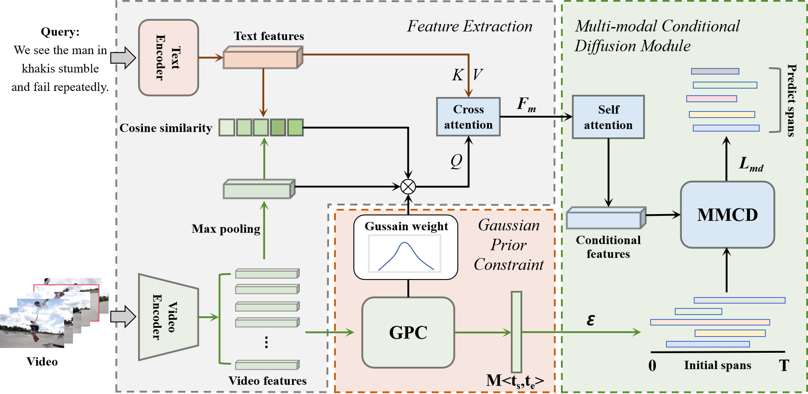

# PointDiff

Official PyTorch implementation of the paper:  
**"PointDiff: Conditional Diffusion Model for Point-supervised Video Moment Retrieval."**  
[[📄 Paper Link](#)]]

---

## 🧠 Overview
This repository contains the official implementation of our paper *"PointDiff: Conditional Diffusion Model for Point-supervised Video Moment Retrieval."*, which focuses on **video understanding** in the field of deep learning.  
Our approach aims to [].

---

## 🏗️ Architecture

  

**Figure:** The overall architecture of the proposed framework.

## 📦 Datasets
We evaluate our method on the following public datasets:

| Dataset | Download Link | Description |
|----------|----------------|--------------|
| [Charades-STA] | [🔗 Download](#) | [基于 Charades 视频数据集扩展而来，包含超过 1 万条视频，涵盖 157 种动作类别。] |
| [ActivityNet Captions] | [🔗 Download](#) | [建立在ActivityNet v1.3基础上的，其中包括2万个YouTube未剪辑视频，具有10万个字幕注释。] |
| [TACoS] | [🔗 Download](#) | [用于视频描述和活动识别的高分辨率视频数据集，主要记录了基本烹饪过程。] |
